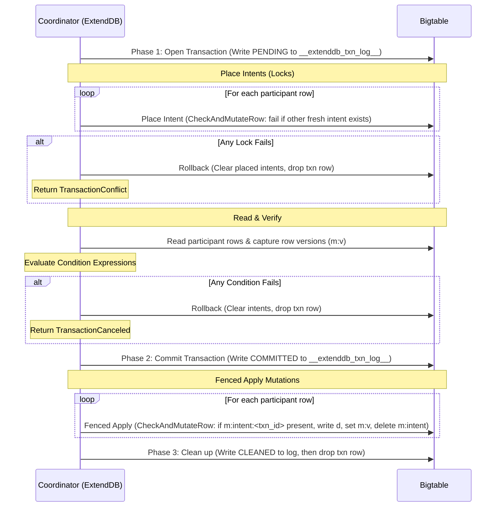

# RFC-0003: Cloud Bigtable Storage Backend for ExtendDB

- Status: Draft
- Author: @annguy3n
- Created: 2026-06-29
- Tracking issue: #185

## Summary

This RFC defines the design and implementation of a production-grade Cloud Bigtable storage backend for ExtendDB. It addresses critical architectural requirements for this backend: transaction isolation, stream emissions in transactions, Global Secondary Index (GSI) projections, GSI write consistency, Time-to-Live (TTL) eviction scalability, Optimistic Concurrency Control (OCC) row versioning, fenced two-phase commit (2PC) apply, application profile single-cluster routing, and secure Google Cloud Platform (GCP) connectivity.

## Motivation

A naive mapping of DynamoDB structures to Bigtable introduces several architectural challenges that must be addressed to ensure production-readiness:
1.  **Transaction Isolation Leak & TOCTOU Races:** Non-transactional (single-row) conditional writes read an item and evaluate conditions without atomic concurrency control, leading to Time-of-Check to Time-of-Use (TOCTOU) races where concurrent writes can overwrite uncommitted state or bypass 2-Phase Commit (2PC) locks.
2.  **2PC Race Condition (Read-then-Lock & Unfenced Apply):** Reading row data before placing locks exposes 2PC to TOCTOU races. Furthermore, applying 2PC Phase 2 mutations unconditionally without fencing against expired/aborted locks allows slow coordinators to overwrite newer state.
3.  **Missing Transaction Streams:** Multi-row transactions (`TransactWriteItems`) do not emit DynamoDB Stream records.
4.  **Inefficient TTL Eviction:** The TTL worker performs full-table scans to identify expired items, which degrades performance on large datasets.
5.  **GSI Consistency Gap:** GSI shadow table write failures are logged without retry or repair, causing permanent base-to-shadow divergence.
6.  **Multi-Cluster Replication & Conditional Mutations:** Cloud Bigtable rejects conditional mutations (`CheckAndMutateRow`) under multi-cluster routing with eventual consistency.
7.  **Auth Configuration Constraints:** Lack of support for explicit credentials file configuration.

This RFC provides the technical specification to resolve these challenges.

## Detailed Design

### 1. Table Mapping & Key Encoding

#### A. Table Structure & Naming
*   **Catalog:** System metadata, accounts, and policies are stored in a single table named `__extenddb_catalog__`.
*   **Data Tables:** DynamoDB tables map to Bigtable tables named `t<table_id_hex>` (where `table_id_hex` is a 32-character hex UUID). Data attributes are stored in column family `d`.
*   **GSIs:** Shadow tables are named `t<table_id_hex>_g<idx_hash>` (where `idx_hash` is an 8-character hash of the index name).
*   **Transaction Intents & OCC Versions:** Column family `m` in data tables stores lock/intent cells (`m:intent:<txn_id>`) and explicit OCC row versions (`m:v`).
*   **TTL Markers:** Column family `t` (reserved).

> [!NOTE]
> **Naming Constraints:** Table IDs in Cloud Bigtable are limited to 50 characters. To prevent overflow, GSIs are named `t<table_id_hex>_g<idx_hash>` (43 characters total) rather than reproducing the full index name.

#### B. Exact Decimal & Order-Preserving Key Encoding
Cloud Bigtable sorts row keys by raw byte lexicographical order. The maximum row key size supported by Cloud Bigtable is **4KB (4096 bytes)**, which is strictly enforced during key encoding (`row_key::encode_key`).

Row keys are encoded using the following structured layout:
```text
Composite Key: [pk_tag:1] [pk_len:u32BE:4] [pk_bytes] [sk_tag:1] [sk_bytes]
PK-Only Key:   [pk_tag:1] [pk_len:u32BE:4] [pk_bytes]
```
Where `pk_tag` and `sk_tag` identify the DynamoDB scalar type (`0x53` for `S`, `0x4E` for `N`, `0x42` for `B`).

*   **Partition (HASH) Keys:** Partition keys use **length-prefixing** (`[pk_len:u32BE:4]`) preceding `[pk_bytes]`. Length prefixing is essential to delimit variable-length partition keys, prevent ambiguity/delimiter collision, and group all items sharing the same partition key contiguously within Bigtable's lexicographical keyspace.
*   **Sort (RANGE) Keys:** Sort keys are stored as **raw order-preserving bytes without length prefixing**. Omitting the length prefix on sort keys is strictly mandatory: length-prefixing sort keys would sort primarily by byte-length rather than value, leading to severe sort inversion (for example, `"10"` of length 2 would sort before `"2"` of length 1, or shorter numbers would sort before longer numbers).
*   **Number Encoding:** DynamoDB supports numeric values with up to 38 significant digits and requires exact numerical sorting (e.g., `-100 < -1.5 < -1 < 0 < 0.5 < 1 < 1.5 < 100`). Numbers are stored as exact arbitrary-precision decimals (never floating point floats) using an order-preserving byte encoding:
    *   **Negative numbers:** Sign byte `0x00`, followed by bit-inverted exponent and complement mantissa bytes.
    *   **Zero:** Exactly `[0x80]`.
    *   **Positive numbers:** Sign byte `0x81`, followed by big-endian exponent bytes and binary-coded decimal mantissa bytes.
*   **GSI Index Row Keys:** Primary keys in GSI shadow tables follow the exact same encoding rules for the index partition and sort keys, formatted as `[gsi_pk_tag][gsi_pk_len][gsi_pk_bytes][gsi_sk_tag][gsi_sk_bytes][base_pk_tag][base_pk_len][base_pk_bytes][base_sk_tag][base_sk_bytes]`, ensuring full sort order preservation and primary key uniqueness.

### 2. Transaction Rules & Isolation Guarantees

#### A. Transaction Validation & Idempotency Rules
*   **`ClientRequestToken` Idempotency:** `TransactWriteItems` enforces idempotency within a 10-minute sliding window. Requests with an active or recently committed token replay the committed result; conflicting requests with the same token but mismatched payload return `IdempotentParameterMismatchException`.
*   **Duplicate Participant Rejection:** A single `TransactWriteItems` request cannot contain multiple operations on the same item. Any transaction with duplicate primary keys is rejected upfront with `ValidationException`.

#### B. Lock-then-Read 2PC Flow
The `TransactWriteItems` coordinator acquires locks *before* reading data and evaluating condition expressions, and applies mutations via fenced CAS:



#### C. Read Isolation & Concurrency Guarantees
*   **Read Committed (No Dirty Reads):** In Phase 1 / Phase 2, the transaction coordinator only writes intent lock markers (`m:intent:<txn_id>`) to column family `m`. Actual data mutations in column family `d` are **only applied in Phase 2 Apply** after the coordinator's `COMMITTED` record is durable in `__extenddb_txn_log__`. Standard reads (`GetItem`, `Query`, `Scan`, `BatchGetItem`) read solely from column family `d` and therefore never observe uncommitted candidate writes that could roll back.
*   **Fenced Phase 2 Apply:** During Phase 2 Apply, participant mutations are applied via `CheckAndMutateRow` using a fencing predicate that asserts the coordinator's own intent marker `m:intent:<txn_id>` is still present on the participant row. The atomic mutation payload applies the data changes to family `d`, updates the row version `m:v`, and deletes `m:intent:<txn_id>` in a single atomic RPC. This guarantees that if an intent was timed out or aborted by the recovery sweeper, a slow/stalled coordinator cannot execute an unfenced write over newer state.
*   **Serializable `TransactGetItems`:** `TransactGetItems` observes the committed set atomically. Before reading data rows, it checks for active intent markers in column family `m`. If an active lock is present, it coordinates with `__extenddb_txn_log__` to observe the snapshot at the transaction commit boundary, preventing dirty or partial reads.
*   **Cross-Row Visibility for Standard Reads:** Standard `Query` or `Scan` operations may observe some participant rows updated before others across separate Bigtable tables during the commit apply window. This is fully compliant with DynamoDB's `Read Committed` isolation model, as every observed row reflects a durable, committed state.

#### D. Optimistic Concurrency Control (OCC) Row Versioning for Single-Row Writes
All single-row writes (`PutItem`, `UpdateItem`, `DeleteItem`) maintain an explicit row version in column family `m` under qualifier `v` (`u64` monotonic counter or epoch timestamp) and execute via atomic `CheckAndMutateRow` to prevent TOCTOU race conditions and protect 2PC transactions:
*   **Version Tracking (`m:v`):** Every row write writes data attributes into column family `d` and increments/sets the row version `m:v`.
*   **Conditional Writes (`PutItem`, `UpdateItem`, `DeleteItem` with `ConditionExpression`):**
    1.  **Read & Version Capture:** The engine reads the current row from Bigtable, extracting the existing item and capturing `read_version = m:v` (`Option<u64>`).
    2.  **In-Memory Condition Evaluation:** `evaluate_condition` checks the condition expression against the read image. If false, `StorageError::ConditionFailed` is returned immediately.
    3.  **Atomic OCC CAS Mutation:** The write is submitted via `CheckAndMutateRow`:
        *   **Existing Row (`read_version = Some(v)`):** Predicate filter uses a composite condition: `(no active intent in m) AND (m:v == v)`. Mutations (write `d`, set `m:v = v + 1`, or delete `d` and `m:v`) are placed in `true_mutations`. If the row was modified concurrently or locked, `predicate_matched == false`, and the engine returns `TransactionConflict`.
        *   **New Row Insert (`read_version = None`):** Predicate filter matches if `(active intent exists in m) OR (m:v exists) OR (family d exists)`. Mutations are placed in `false_mutations`. If the row already exists or is locked, `predicate_matched == true`, and the engine returns `TransactionConflict`.
*   **Unconditional Writes:**
    *   **Predicate Filter:** Matches if an active 2PC intent exists in family `m` (`^intent:.*$` with timestamp $\ge$ `now - intent_timeout`).
    *   **Mutations:** In `false_mutations`, updates family `d` and sets `m:v = now_micros` (or incremented counter).
*   **Deletes:** Use `DeleteFromFamily(d)` and `DeleteFromColumn(m:v)` instead of `DeleteFromRow` to preserve any concurrent 2PC intent markers in family `m`.

#### E. Cloud Bigtable App Profile & Single-Cluster Routing Requirements
Cloud Bigtable requires single-cluster routing (or multi-cluster routing with single-row transactions enabled) to execute conditional mutations (`CheckAndMutateRow`). Multi-cluster instance routing configured with eventual consistency does not allow conditional mutations and rejects `CheckAndMutateRow` requests with `FailedPrecondition`.
*   **Configuration (`app_profile_id`):** `BigtableStorageConfig` provides an optional `app_profile_id` field. When connecting to multi-cluster Bigtable instances, administrators must configure an application profile routed to a single cluster to ensure atomic OCC CAS mutations and 2PC intent locks operate correctly.

#### F. Garbage Collection (GC) Rules
To prevent disk bloat and ensure fast lookups, tables provisioned by ExtendDB configure explicit Garbage Collection rules on all column families:
*   **Data Column Family (`d`):** `MaxVersions(1)` retains only the latest cell version, compacting away historical cell values.
*   **Metadata Column Family (`m`):** `MaxVersions(1)` retains only the latest row version `m:v` and intent markers.
*   **System Tables:** Catalog table (`__extenddb_catalog__`), transaction log table (`__extenddb_txn_log__`), and TTL index table (`__extenddb_ttl_index__`) are all configured with `MaxVersions(1)`.

#### G. Recovery Sweeper
A background worker periodically scans `__extenddb_txn_log__` for transactions older than `intent_timeout`:
*   **`PENDING` State:** Clear intents on participant rows and delete the coordinator row (rollback).
*   **`COMMITTED` State:** Re-apply mutations to participant rows via fenced `apply_fenced_mutation`, write stream records, clear intents, and delete the coordinator row (roll-forward).

### 3. Stream Emissions in Transactions

To ensure stream record atomicity:
1.  **Phase 1 (Prepare):** Fetch the full `TableDescription` (including `StreamSpecification` and `latest_stream_arn`) and pre-generate the `StreamRecord` payloads.
2.  **Phase 2 (Log Enrichment & Commit):** Store the pre-generated stream record payloads and participant mutation payloads in the coordinator row of `__extenddb_txn_log__` alongside `COMMITTED`, and apply stream records to `__extenddb_streams__` concurrently with data mutations.
3.  **Recovery:** The recovery sweeper uses the payloads stored in the log to roll forward stream writes on crash.

### 4. Scalable TTL Indexing & Streams Integration

Avoid full-table scans by introducing a sharded TTL index table.

#### A. TTL Index Table Schema
*   **Table Name:** `__extenddb_ttl_index__`
*   **Row Key format (Binary):** `[shard_id:1] [expiry_timestamp_be:8] [account_id_len:1] [account_id] [table_name_len:1] [table_name] [encoded_base_row_key]`
    *   `shard_id` (1 byte): `hash(base_row_key) % 16` (prevents write hotspotting).
    *   `expiry_timestamp_be` (8 bytes): Big-Endian `u64` representing the TTL epoch second.
    *   `encoded_base_row_key` (variable): Raw row key of the target item.
*   **Payload:** None (empty values).
*   **GC Rule:** `MaxVersions(1)` on family `d`.

#### B. Maintenance
*   **Writes:** Insert an empty row in `__extenddb_ttl_index__` when writing an item with a TTL attribute.
*   **Updates/Deletes:** Delete the old index entry using the item's prior image.

#### C. Sweeper Flow & Stream Emission
1.  Perform parallel range scans across all 16 shards from `start_key = [S] [0]` to `end_key = [S] [current_time_epoch_s + 1]`.
2.  For each expired entry, read the base row and verify its current TTL matches the index entry.
3.  If valid, execute `delete_item` on the base table.
4.  **TTL Stream Records:** When DynamoDB Streams are enabled on the table, TTL deletions emit a `REMOVE` stream record containing `userIdentity.type = "Service"` and `userIdentity.principalId = "dynamodb.amazonaws.com"`, matching native DynamoDB behavior.
5.  If invalid (stale index), delete the index entry.

### 5. GSI Projections & Consistency

#### A. Projection Validation & ConsistentRead Rejection
Enforce DynamoDB GSI projection behavior:
*   **Read Path:** Queries on GSIs with `KEYS_ONLY` or `INCLUDE` projections return only the projected attributes.
*   **Validation:** If the client requests `Select: ALL_ATTRIBUTES` (or requests non-projected attributes) on a non-`ALL` GSI, return `ValidationException`. Do not perform base table fetches.
*   **ConsistentRead Rejection:** Queries on GSIs with `ConsistentRead = true` are rejected with `ValidationException` (matching DynamoDB API rules).
*   **Defaulting:** If `Select` is omitted in a GSI query, default to `Select::AllProjectedAttributes`.

#### B. Background Reconciler
Implement a reconciler as an internal background worker spawned via `ServerRuntimeHooks::spawn_workers`. The worker scans GSIs, compares them with the base tables, and repairs missing, orphaned, or mismatched shadow rows, preventing phantom records from returning during divergence windows.

### 6. GCP Credentials & Bigtable Configuration

Extend `BigtableStorageConfig` to support explicit service account files and app profiles:

```toml
[storage.bigtable]
project_id = "my-project"
instance_id = "my-instance"
data_instance_id = "my-data-instance" # Optional (separates catalog/data)
app_profile_id = "default"            # Optional (requires single-cluster routing for CheckAndMutateRow)
credentials_path = "/path/to/sa-key.json" # Optional (service account JSON)
pool_size = 20
```

*   **Behavior:** If `credentials_path` is specified, the server programmatically acquires tokens from the service account key. Configure `tonic` channels with `ClientTlsConfig` using native system roots.
*   **App Profile:** If `app_profile_id` is specified, data client requests use the designated profile to ensure single-cluster routing for conditional mutations.

### 7. Future Work & Non-Goals

*   **Backup / PITR / Export (`BackupEngine`):** `BigtableEngine` implements the `extenddb_storage::BackupEngine` supertrait with explicit `StorageError::Internal("Operation not supported")` stubs. Point-in-Time Recovery (PITR), native Bigtable table backups, and Cloud Storage (GCS) exports require dedicated lifecycle orchestration and are deferred to a dedicated follow-up RFC. Note that Cloud Bigtable's native backup retention windows and export capabilities have distinct operational characteristics from DynamoDB's fixed 35-day PITR window.

## Testing Strategy

1.  **Unit Tests (Emulator-based):**
    *   Verify exact decimal number key encoding/decoding and numerical sorting up to 38 significant digits.
    *   Verify row key 4KB size enforcement and partition length prefixing vs raw sort key ordering.
    *   Verify OCC row versioning (`m:v`) decoding and composite `CheckAndMutateRow` filter construction.
    *   Verify 2PC coordinator state transitions, fenced apply predicate, and idempotency token deduplication.
    *   Assert `ValidationException` is returned for invalid GSI attribute requests and `ConsistentRead = true` on GSIs.
    *   Assert `BackupEngine` methods return `StorageError::Internal("Operation not supported")`.
2.  **Failure Integration Tests (Real Bigtable & Emulator):**
    *   Inject crashes during the 2PC flow and assert that the recovery sweeper rolls forward/back using fenced mutations and preserves stream record writes.
    *   Run concurrent mixed workloads to verify transactional serializability and OCC conflict detection on single-row writes.
    *   Verify GSI reconciler heals base-to-shadow mismatches.
    *   Verify TTL sweeper emits `REMOVE` stream records with the TTL principal and ignores updated items with old index entries.
3.  **E2E & Chaos Tests:**
    *   Run the Python integration suite (`devtools/run-tests --extenddb --pytest`) against production Bigtable.
    *   Inject network partitions during `TransactWriteItems` to verify 2PC resilience.

## Alternatives Considered

*   **Unprotected Single-Row Writes:** Bypassing intent checks for single-row writes allows dirty writes, violating serializability. Rejected.
*   **Scan-Based TTL Sweeper:** Scanning the entire base table to evict items degrades performance at scale. Rejected.
*   **Length-Prefixed Sort Keys:** Length-prefixing sort keys in composite primary keys caused sort inversion where shorter string/numeric representations sorted before longer ones regardless of value. Rejected in favor of raw order-preserving sort key bytes.
*   **Cloud Spanner Backend:** Cloud Spanner supports multi-row transactions natively, eliminating the need for application-layer 2PC. This is a viable alternative to be explored as a separate backend connector.
