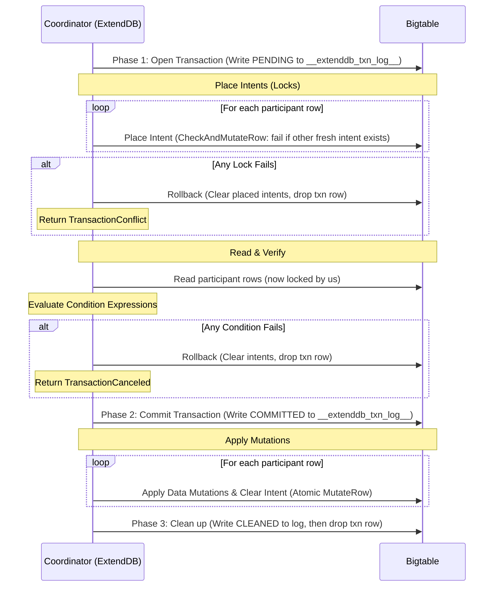

# RFC-0003: Cloud Bigtable Storage Backend for ExtendDB

- Status: Draft
- Author: @annguy3n
- Created: 2026-06-29
- Tracking issue: #185

## Summary

This RFC defines the design and implementation of a production-grade Cloud Bigtable storage backend for ExtendDB. It addresses critical architectural requirements for this new backend: transaction isolation, stream emissions in transactions, Global Secondary Index (GSI) projections, GSI write consistency, Time-to-Live (TTL) eviction scalability, and secure Google Cloud Platform (GCP) connectivity.

## Motivation

A naive mapping of DynamoDB structures to Bigtable introduces several architectural challenges that must be addressed to ensure production-readiness:
1.  **Transaction Isolation Leak:** Non-transactional (single-row) writes bypass 2-Phase Commit (2PC) locks (intents), enabling dirty writes and lost updates.
2.  **2PC Race Condition (Read-then-Lock):** The 2PC coordinator reads row data before placing locks, exposing the system to Time-of-Check to Time-of-Use (TOCTOU) races.
3.  **Missing Transaction Streams:** Multi-row transactions (`TransactWriteItems`) do not emit DynamoDB Stream records.
4.  **Inefficient TTL Eviction:** The TTL worker performs full-table scans to identify expired items, which degrades performance on large datasets.
5.  **GSI Consistency Gap:** GSI shadow table write failures are logged without retry or repair, causing permanent base-to-shadow divergence.
6.  **Auth Configuration Constraints:** Lack of support for explicit credentials file configuration.

This RFC provides the technical specification to resolve these challenges.

## Detailed Design

### 1. Table Mapping & Key Encoding

#### A. Table Structure & Naming
*   **Catalog:** System metadata, accounts, and policies are stored in a single table named `__extenddb_catalog__`.
*   **Data Tables:** DynamoDB tables map to Bigtable tables named `t<table_id_hex>` (where `table_id_hex` is the first 16 hex characters of the table UUID, 17 characters total). Data attributes are stored in column family `d`.
*   **GSIs:** Shadow tables are named `t<table_id_hex>_g<idx_hash>` (where `idx_hash` is an 8-character hash of the index name, 27 characters total).
*   **Transaction Intents:** Column family `m` in data tables stores lock/intent cells.
*   **TTL Markers:** Column family `t` (reserved).

> [!NOTE]
> **Naming Constraints:** Table IDs in Cloud Bigtable are limited to 50 characters. To prevent overflow, GSIs are named `t<table_id_hex>_g<idx_hash>` (27 characters total) rather than reproducing the full index name.

#### B. Exact Decimal & Order-Preserving Key Encoding
Cloud Bigtable sorts row keys by raw byte lexicographical order. To maintain exact DynamoDB semantics:
*   **String & Binary Keys:** Encoded verbatim with null-byte / length-prefixed terminators to preserve lexicographical sort order.
*   **Number Keys:** DynamoDB supports numeric values with up to 38 significant digits and requires numerical sorting (e.g., `-10 < -2 < 0 < 1.5 < 2 < 100`). Numbers are stored as exact arbitrary-precision decimals (never floating point floats) using an order-preserving byte encoding:
    *   **Negative numbers:** Sign byte `0x00`, followed by 1-byte bit-inverted biased exponent (`~exp_biased`), and 38-byte inverted mantissa digits (`9 - digit`) padded with `0x09`.
    *   **Zero:** Exactly `[0x80]`.
    *   **Positive numbers:** Sign byte `0xFF`, followed by 1-byte biased exponent (`exp_biased = sci_exp + 130`), and 38-byte normalized decimal digits padded with `0x00`.
*   **GSI Index Row Keys:** Primary keys in GSI shadow tables are formatted as `[encoded_gsi_pk][encoded_gsi_sk]\xFE[encoded_base_pk][encoded_base_sk]`, reusing the exact order-preserving/length-prefixed encoding of the base table. The `0xFE` byte acts as a structural separator between the secondary and base key components, avoiding bare null-byte collisions and preserving uniqueness and sort parity.

### 2. Transaction Rules & Isolation Guarantees

#### A. Transaction Validation & Idempotency Rules
*   **`ClientRequestToken` Idempotency:** `TransactWriteItems` enforces idempotency within a 10-minute sliding window. Requests with an active or recently committed token replay the committed result; conflicting requests with the same token but mismatched payload return `IdempotentParameterMismatchException`.
*   **Duplicate Participant Rejection:** A single `TransactWriteItems` request cannot contain multiple operations on the same item. Any transaction with duplicate primary keys is rejected upfront with `ValidationException`.

#### B. Lock-then-Read 2PC Flow
Refactor the `TransactWriteItems` coordinator to acquire locks *before* reading data and evaluating condition expressions:



#### C. Read Isolation & Concurrency Guarantees
*   **Read Committed (No Dirty Reads):** In Phase 1, the coordinator only writes intent lock markers to column family `m`. Actual data mutations in column family `d` are **only applied in Phase 2** after the coordinator's `COMMITTED` record is durable in `__extenddb_txn_log__`. Standard reads (`GetItem`, `Query`, `Scan`, `BatchGetItem`) read solely from column family `d` and therefore never observe uncommitted candidate writes that could roll back.
*   **Serializable `TransactGetItems`:** `TransactGetItems` observes the committed set atomically by reading all requested rows and checking for active intent markers in column family `m`. Because Bigtable lacks cross-row atomic snapshots, if *any* requested row has an active intent lock, the request immediately blocks and retries. By deferring the read until all participant locks are cleared (Phase 3), the read never observes partial transaction state, guaranteeing Serializable visibility.
*   **Read-Your-Writes (Ack Point):** To guarantee that strongly-consistent `GetItem` or `Query` requests observe applied transaction data, the coordinator defers the HTTP 200 OK success acknowledgment (client ack) until *after* all Phase 2 mutations (data and streams) are definitively applied to column family `d`.
*   **Cross-Row Visibility for Standard Reads:** During the 2PC apply window (Phase 2), standard `Query` or `Scan` operations may observe some participant rows updated before others across separate Bigtable tables. This is fully compliant with DynamoDB's `Read Committed` isolation model, as every observed row reflects a durable, committed state.

#### D. Guarding Single-Row Writes
All single-row mutations (`PutItem`, `UpdateItem`, `DeleteItem`) must run via `CheckAndMutateRow` to prevent overwriting active 2PC locks:
*   **Predicate:** Matches if a cell exists in family `m` with qualifier `intent:*` and a timestamp $\ge$ `now - intent_timeout`.
*   **False Mutations (No Lock):** Execute the mutation.
*   **True Mutations (Locked):** None. Returns `TransactionConflict` (client retries).
*   **Deletes:** Use `DeleteFromFamily(d)` instead of `DeleteFromRow` to preserve the intent family `m`.

#### E. Recovery Sweeper
A background worker periodically scans `__extenddb_txn_log__` for transactions older than `intent_timeout`:
*   **`PENDING` State:** Clear intents on participant rows and delete the coordinator row (rollback).
*   **`COMMITTED` State:** Re-apply mutations to participant rows, write stream records, clear intents, and delete the coordinator row (roll-forward).

### 3. Stream Emissions in Transactions

To ensure stream record atomicity:
1.  **Phase 1 (Prepare):** Fetch the full `TableDescription` (including `StreamSpecification` and `latest_stream_arn`) and pre-generate the `StreamRecord` payloads.
2.  **Phase 2 (Log Enrichment & Commit):** Store the pre-generated stream record payloads and participant mutation payloads in the coordinator row of `__extenddb_txn_log__` alongside `COMMITTED`, and apply stream records to `__extenddb_streams__` concurrently with data mutations.
3.  **Recovery:** The recovery sweeper uses the payloads stored in the log to roll forward stream writes on crash.

### 4. Scalable TTL Indexing & Streams Integration

Avoid full-table scans by introducing a sharded TTL index table.

#### A. TTL Index Table Schema
*   **Table Name:** `__extenddb_ttl_index__`
*   **Row Key format (Binary):** `[shard_id:1] [expiry_timestamp_be:8] [account_id_len:1] [account_id] [table_name_len:1] [table_name] [encoded_base_row_key]`
    *   `shard_id` (1 byte): `hash(base_row_key) % 16` (prevents write hotspotting).
    *   `expiry_timestamp_be` (8 bytes): Big-Endian `u64` representing the TTL epoch second.
    *   `encoded_base_row_key` (variable): Raw row key of the target item.
*   **Payload:** None (empty values).

#### B. Maintenance
*   **Writes:** Insert an empty row in `__extenddb_ttl_index__` when writing an item with a TTL attribute.
*   **Updates/Deletes:** Delete the old index entry using the item's prior image.

#### C. Sweeper Flow & Stream Emission
1.  Perform parallel range scans across all 16 shards from `start_key = [S] [0]` to `end_key = [S] [current_time_epoch_s + 1]`.
2.  For each expired entry, read the base row and verify its current TTL matches the index entry.
3.  If valid, execute `delete_item` on the base table.
4.  **TTL Stream Records:** When DynamoDB Streams are enabled on the table, TTL deletions emit a `REMOVE` stream record containing `userIdentity.type = "Service"` and `userIdentity.principalId = "dynamodb.amazonaws.com"`, matching native DynamoDB behavior.
5.  If invalid (stale index), delete the index entry.

### 5. GSI Projections & Consistency

#### A. Projection Validation & ConsistentRead Rejection
Enforce DynamoDB GSI projection behavior:
*   **Read Path:** Queries on GSIs with `KEYS_ONLY` or `INCLUDE` projections return only the projected attributes.
*   **Validation:** If the client requests `Select: ALL_ATTRIBUTES` (or requests non-projected attributes) on a non-`ALL` GSI, return `ValidationException`. Do not perform base table fetches.
*   **ConsistentRead Rejection:** Queries on GSIs with `ConsistentRead = true` are rejected with `ValidationException` (matching DynamoDB API rules).
*   **Defaulting:** If `Select` is omitted in a GSI query, default to `Select::AllProjectedAttributes`.

#### B. Background Reconciler
Implement a reconciler as an internal background worker spawned via `ServerRuntimeHooks::spawn_workers`. The worker scans GSIs, compares them with the base tables, and repairs missing, orphaned, or mismatched shadow rows, preventing phantom records from returning during divergence windows.

### 6. GCP Credentials Configuration

Extend `BigtableStorageConfig` to support explicit service account files:

```toml
[storage.bigtable]
project_id = "my-project"
instance_id = "my-instance"
data_instance_id = "my-data-instance" # Optional
credentials_path = "/path/to/sa-key.json" # Optional
pool_size = 20
```

*   **Behavior:** If `credentials_path` is specified, the server programmatically acquires tokens from the service account key. Configure `tonic` channels with `ClientTlsConfig` using native system roots.

### 7. Future Work & Non-Goals

*   **Backup / PITR / Export:** Point-in-Time Recovery (PITR) and automated backup snapshots are deferred to a follow-up RFC. Note that Cloud Bigtable's native backup retention windows and export capabilities will have different retention characteristics from DynamoDB's fixed 35-day PITR window.

## Testing Strategy

1.  **Unit Tests (Emulator-based):**
    *   Verify exact decimal number key encoding/decoding and numerical sorting up to 38 significant digits.
    *   Mock Bigtable client to verify 2PC coordinator state transitions and idempotency token deduplication.
    *   Assert `ValidationException` is returned for invalid GSI attribute requests and `ConsistentRead = true` on GSIs.
2.  **Failure Integration Tests (Real Bigtable & Emulator):**
    *   Inject crashes during the 2PC flow and assert that the recovery sweeper rolls forward/back and preserves stream record writes.
    *   Run concurrent mixed workloads to verify transactional serializability.
    *   Verify GSI reconciler heals base-to-shadow mismatches.
    *   Verify TTL sweeper emits `REMOVE` stream records with the TTL principal and ignores updated items with old index entries.
3.  **E2E & Chaos Tests:**
    *   Run the Python integration suite (`devtools/run-tests --extenddb --pytest`) against production Bigtable.
    *   Inject network partitions during `TransactWriteItems` to verify 2PC resilience.

## Alternatives Considered

*   **Unprotected Single-Row Writes:** Bypassing intent checks for single-row writes allows dirty writes, violating serializability. Rejected.
*   **Scan-Based TTL Sweeper:** Scanning the entire base table to evict items degrades performance at scale. Rejected.
*   **Cloud Spanner Backend:** Cloud Spanner supports multi-row transactions natively, eliminating the need for application-layer 2PC. This is a viable alternative to be explored as a separate backend connector.

